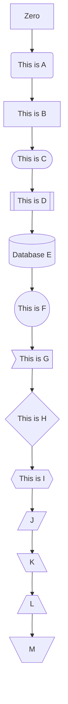

# Node Type

```shell
graph TD

Zero

A(This is A)

B[This is B]

C([This is C])

D[[This is D]]

E[(Database E)]

F((This is F))

G>This is G]

H{This is H}

I{{This is I}}

J[/J/]

K[\K\]

L[/L\]

M[\ M/]

Zero --> A --> B --> C --> D --> E --> F --> G --> H --> I --> J --> K --> L --> M
```

