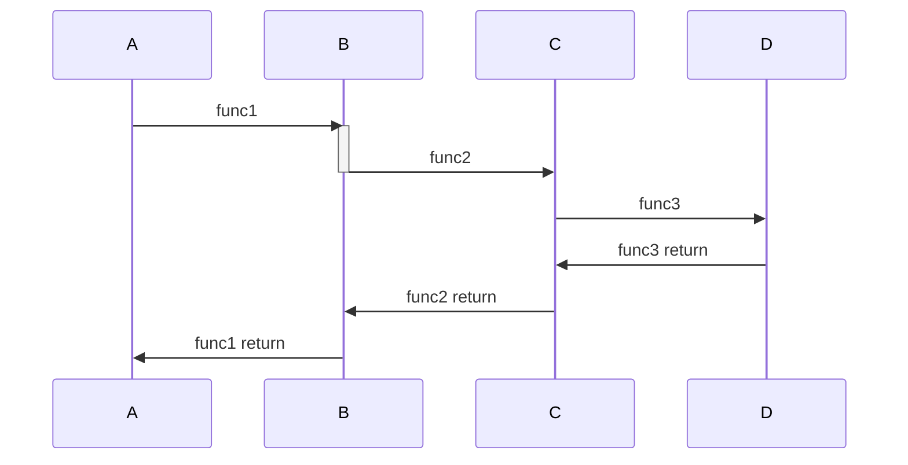
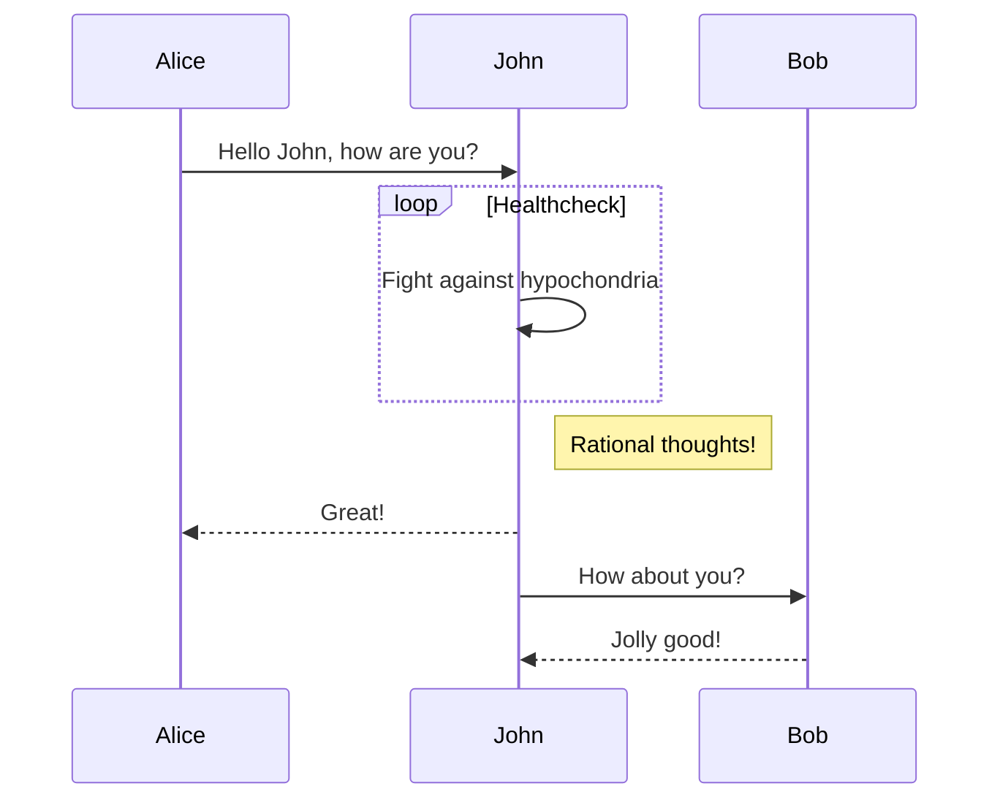

# Sequence

```shell
sequenceDiagram
  A->>B: func1
  activate B
  B->>C: func2
  deactivate B
  C->>D: func3
  D->>C: func3 return
  C->>B: func2 return
  B->>A: func1 return
```



```shell
sequenceDiagram

Alice->>John: Hello John, how are you?
loop Healthcheck
John->>John: Fight against hypochondria
end
Note right of John: Rational thoughts!
John-->>Alice: Great!
John->>Bob : How about you?
Bob-->>John : Jolly good!
```


