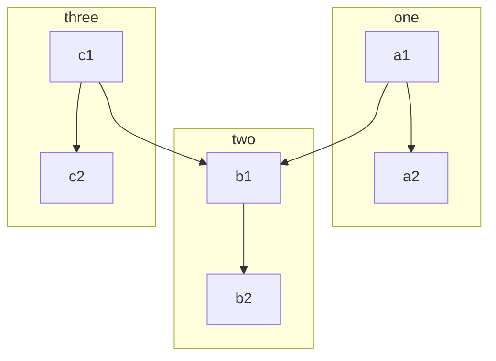

# Subgraph

```shell
graph TD
    subgraph one
    a1-->a2
    end

    subgraph two
    b1-->b2
    end

    subgraph three
    c1-->c2
    end

    a1 & c1 --> b1
```


```mermaid
graph TD
    subgraph one
    a1-->a2
    end

    subgraph two
    b1-->b2
    end

    subgraph three
    c1-->c2
    end

    a1 & c1 --> b1
```
